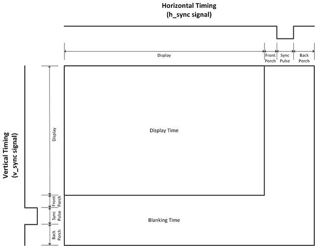
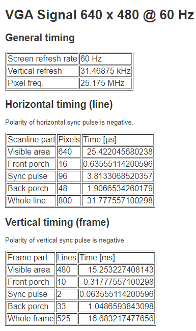
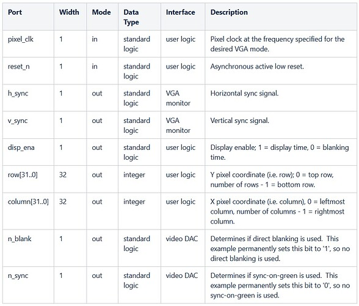

# FPGA Dithering

Implementation of [Ordered Dithering](https://en.wikipedia.org/wiki/Ordered_dithering)
algorithm for FPGA.

## The board

Built for RZ-EasyFPGA A2.2

## The project

### VGA display

For more reference on VGA displays on this board, check this repo:

> https://github.com/fsmiamoto/EasyFPGA-VGA

For this project, we are going to use DigiKey's implementation of a VGA
controller in VHDL.

https://forum.digikey.com/t/vga-controller-vhdl/12794

The controller should follow the VGA spec, needing to display pixels in the
correct timing according to this sheet:

The provided `VgaController` is generic and can be configured with any timing specification.

As the RZ-EasyFPGA A2.2 only supports a fixed 50MHz clock, we can only output
640x480@60Hz (25Mhz Pixel Frequency) or 800x600@72Hz (50Mhz pixel freq).

> http://tinyvga.com/vga-timing/640x480@60Hz

For connecting with the actual board, we are going to use the following ports
from the VgaController:

