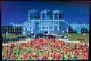

# FPGA Dithering

Implementation of [Ordered Dithering](https://en.wikipedia.org/wiki/Ordered_dithering)
algorithm for Cyclone IV FPGA.

| Original image                 | No dithering (rounding pixels)   | Dithering                     |
| ------------------------------ | -------------------------------- | ----------------------------- |
|  |  |  |
|     |     |     |

> Photos taken from my cellphone camera, pointed at a LCD screen with VGA input

- ✔️ 2x2 Bayer Dithering
- ✔️ 8-bit grayscale dithering to 1-bit BW
- ✔️ 24-bit RGB dithering to 3-bit RGB
- ✔️ 640x480@60Hz VGA output
- ✔️ Images up to 34Kb in size (uncompressed)

Built for _RZ-EasyFPGA A2.2_, a simple board based on Cyclone IV FPGA, easily
found on AliExpress for cheap. The datasheet is non-existent, and the pinage is
in the [docs folder](./docs/RZ-EasyFPGA.jpg).

Although it suits most hobbyist needs, this board is pretty limited.

The builtin VGA port only has a single output bit per channel (R, G, B). It
is not possible to display a full 24-bit pixel to a display without a daughter board.

## Inspiration

This project was inspired by 2 awesome videos:

[](https://www.youtube.com/watch?v=wS0Gck00nDw)

> [HTTP 203 - Dithering](https://www.youtube.com/watch?v=wS0Gck00nDw)

I really recommend watching this video to understand the algorithm:

[](https://www.youtube.com/watch?v=IviNO7iICTM&ab_channel=Computerphile)

> [Computerphile - Ordered Dithering](https://www.youtube.com/watch?v=IviNO7iICTM&ab_channel=Computerphile)

## Dithering

The naïve approach to convert an 8-bit channel to 1-bit would be to simply round
the pixels to their nearest value (1 or 0). However, this limits ourselves to just
basic colors and tends to saturate colors too much, it does not look good on the eyes.
(check the initial table)

Dithering performs some clever mathematics so it looks OK to the human eye.

### Ordered Dithering (Bayer 2x2 method)

Given an 8-bit pixel, calculate the dithered color of the pixel (1-bit), using
the following 2x2 dithering matrix:

```
 ___________
| 64  | 128 |
|-----------|
| 192 |  0  |
 ‾‾‾‾‾‾‾‾‾‾‾
```

For each 2x2 block of the original image, we apply the matrix according to the
following rule: If the pixel value is greater than the matrix entry for that
matrix entry, the pixel is dithered to white; otherwise it is dithered to black.

For colored images, we simply apply this process on each channel
individually and combine them in the end.

### VGA display

For more reference on VGA displays on this board, check this repo:

> https://github.com/fsmiamoto/EasyFPGA-VGA

For this project, we are going to use DigiKey's implementation of a VGA
controller in VHDL.

https://forum.digikey.com/t/vga-controller-vhdl/12794

The controller should follow the VGA spec, needing to display pixels in the
correct timing according to this sheet:


The provided `VgaController` is generic and can be configured with any timing specification.

As the RZ-EasyFPGA A2.2 only supports a fixed 50MHz clock, we can only output
640x480@60Hz (25Mhz Pixel Frequency) or 800x600@72Hz (50Mhz pixel freq).


> http://tinyvga.com/vga-timing/640x480@60Hz

For connecting with the actual board, we are going to use the following ports
from the VgaController:


